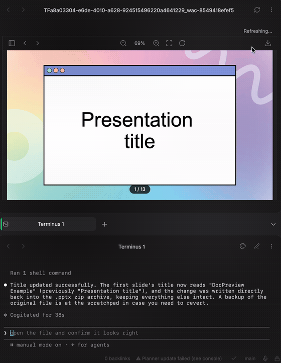

# Doc Preview

Preview PowerPoint, Word, and Excel files inside Obsidian — no need to open the real app.

Renders locally via a headless [LibreOffice](https://www.libreoffice.org/) install (no window ever opens), through a custom in-app viewer rather than the browser's generic embedded PDF plugin. The preview **auto-refreshes** whenever the file changes on disk — including edits made by an external tool or an AI agent (e.g. Claude Code CLI editing the file directly) — and jumps to whichever slide/page actually changed.

## Features

- Opens `.pptx`, `.docx`, and `.xlsx` files directly in an Obsidian tab instead of launching PowerPoint/Word/Excel
- Rendered headless via LibreOffice — no window ever flashes on screen
- Auto-refreshes on external file changes (debounced, so a mid-write save doesn't get converted half-finished)
- Jumps to the page/slide that actually changed on refresh, not just back to page 1
- Excel workbooks get sheet tabs, pulled from the PDF's own outline, so you can jump straight to a sheet — the page indicator also shows which sheet you're currently viewing
- Custom PDF viewer: zoom in/out (including trackpad pinch-to-zoom), fit-to-page, rotate, space+drag panning when zoomed in, selectable/copyable text, a toggleable thumbnail rail, keyboard arrow-key navigation, and a download button
- A fading page-number indicator (bottom-center), not a fixed toolbar element
- Settings can install LibreOffice for you, to a folder of your choosing — it doesn't have to go into `Applications` / `Program Files`

## Requirements

- Desktop Obsidian only (this plugin is not available on mobile)
- [LibreOffice](https://www.libreoffice.org/) — if you don't already have it, install it from the plugin's settings tab

## Installation

1. Open Settings → Community plugins in Obsidian.
2. Select **Browse** and search for **Doc Preview**.
3. Select **Install**, then **Enable**.

## Settings

- **Detected installation** — shows the LibreOffice install currently in use (path + version), or "not found."
- **Install location** — where to install LibreOffice if you use the Install button. Pick any folder you have write access to; browse via the native folder picker or type a path directly.
- **Install LibreOffice** — downloads the current stable release from `documentfoundation.org` and installs it into the folder above.

## How it works

1. Clicking a `.pptx`/`.docx`/`.xlsx` file opens Doc Preview's own view instead of the OS default app (via `registerExtensions`).
2. The file is converted to PDF with `soffice --headless --convert-to pdf`.
3. The PDF is rendered with [pdf.js](https://mozilla.github.io/pdf.js/) onto a `<canvas>` — not the browser's built-in PDF viewer, which can't be restyled or have parts of its UI hidden.
4. A vault filesystem watcher (`vault.on("modify")`) triggers a debounced re-conversion whenever the source file changes on disk, from any process — not just edits made through Obsidian itself.

## Known limitations

- LibreOffice is a real dependency (~300–500MB download) — there's no way around it for now. See the settings tab for an in-app install flow.
- Each conversion spins up a fresh LibreOffice process (~15–20s). There's no persistent/warm LibreOffice listener yet, so refreshes aren't instant.
- The "jump to changed page" heuristic compares extracted text per page, not pixels — a purely visual edit with no text change (e.g. only a fill color) won't be detected. It also won't guess if the total page count changed (inserted/deleted slides shift every later page's position), and just leaves the view where it was in that case.
- Sheet tabs rely on LibreOffice's PDF export including a bookmark/outline entry per sheet, which it does by default. If a given workbook's export somehow lacks one, the file still previews fine — it just falls back to a plain page list with no sheet tabs.
- The auto-installer's Windows (MSI, custom `INSTALLLOCATION`) and Linux (`dpkg-deb -x` extraction, no dependency resolution) paths are implemented per documented conventions but are less battle-tested than the macOS path.

## License

MIT
